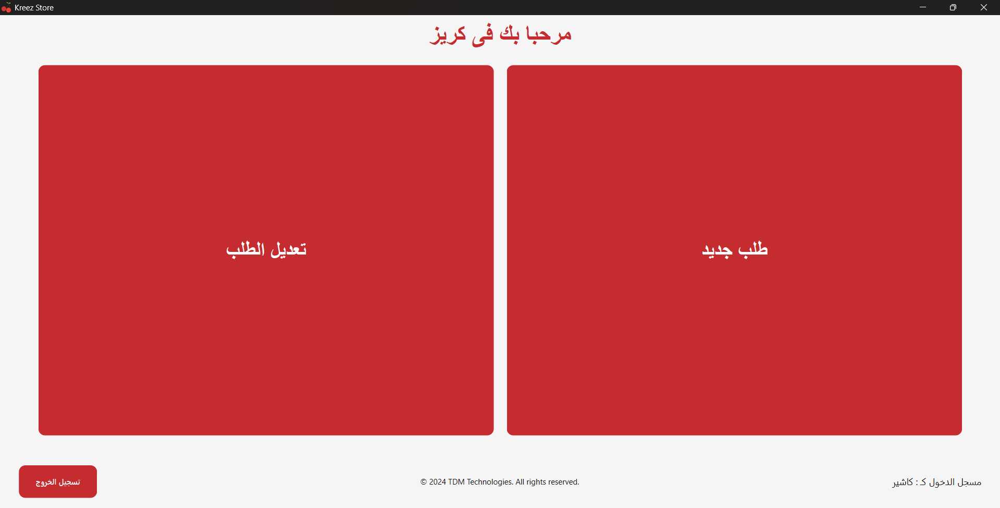

# Kreez Store POS System

## Overview
Kreez Store is a Point of Sale (POS) system designed specifically for juice markets. Built using Python with PyQt6, this application streamlines the process of managing orders, inventory, sales, and reporting. It provides an intuitive interface for employees to handle customer transactions efficiently.

## Features

### 1. User Login
The system begins with a secure login page where users can authenticate themselves before accessing the main functionalities. The login screen ensures that only authorized personnel can manage the store's operations.

### 2. Main Dashboard
Once logged in, users are presented with a clean and organized dashboard. This dashboard offers four primary options:
- **New Order**: Start a new order.
- **Edit Order**: Modify existing orders.
- **Reports**: Generate detailed reports for analysis.
- **Settings**: Adjust various settings related to the store.

### 3. Order Management
The order management section allows users to create and modify orders. Users can select products from a list, choose sizes, and add them to the cart. Additional features include adding customers, applying discounts, and finalizing the order.

#### Creating an Order
Users can easily add items to the cart by selecting the product, size, and quantity. The system automatically calculates the total cost.

#### Finalizing an Order
After adding all the necessary items, users can review the order details, apply any discounts, and finalize the transaction. The system generates a receipt with all the relevant information.

### 4. Receipt Generation
Upon completing an order, the system prints a detailed receipt. The receipt includes the date, order ID, item descriptions, quantities, prices, and the total amount. This ensures transparency and accuracy in every transaction.

### 5. Order Details
Users can view detailed information about each order, including the ability to edit or delete orders. This feature helps in managing and tracking orders effectively.

### 6. Reporting
The reporting section provides valuable insights into the store's performance through various types of reports.

#### Data Extraction
Users can extract data from different tables such as products, orders, and coupons for further analysis.

#### Product Sales Report
This report shows the sales data for individual products, helping managers understand which products are performing well.

#### Weekly Sales Report
A weekly sales report provides an overview of sales trends over a week, aiding in better inventory and stock management.

### 7. Settings
The settings section allows administrators to manage categories, coupons, and user accounts.

### 8. Cashier Dashboard
The cashier dashboard is the central hub for managing daily transactions. It provides quick access to essential functions like creating new orders and modifying existing ones.

#### New Order
Cashiers can start a new order by selecting this option. They can then proceed to add items, specify quantities, and finalize the transaction.

#### Edit Order
If a customer needs changes to their order, cashiers can use this option to modify existing orders. This ensures flexibility and customer satisfaction.

## Technology Stack
- **Programming Language**: Python
- **GUI Framework**: PyQt6
- **Database**: SQLite

## Conclusion
Kreez Store POS System is a robust solution for juice markets, offering a seamless experience for both employees and customers. Its user-friendly interface and comprehensive features make it an ideal choice for managing daily operations efficiently.

## Connect with Me
Feel free to reach out to me on social media for collaborations, feedback, or just to say hi! 😊

- **LinkedIn**: [Keroles Ramses](https://www.linkedin.com/in/keroles-ramses/)
